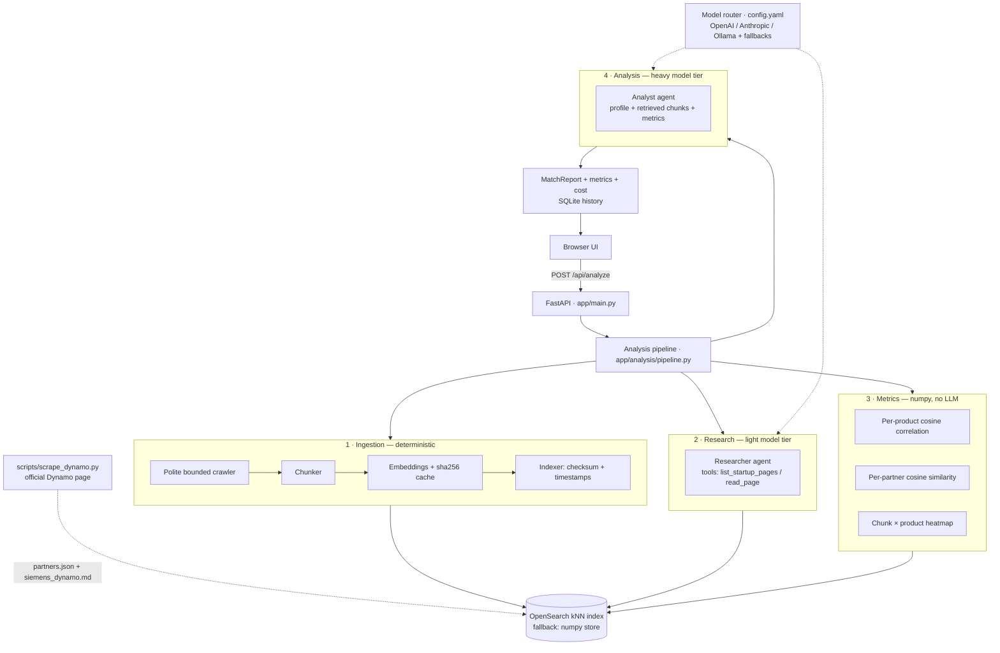

# partner-scout

**LLM-agent web application that evaluates a startup as a potential technology
partner for Siemens Digital Industries Software — from public sources only.**

Give it a startup URL. It crawls and indexes the site (with change detection),
an LLM agent builds a grounded product profile, numeric embedding metrics
measure where the offering correlates with the Siemens portfolio and with the
**real partners of the Siemens Dynamo program**, and a second agent produces
scored, justified analysis — rendered as radar/bar charts and a correlation
heatmap.

Built for the Siemens Dynamo home assignment. Machine-assisted development
(AI coding assistant) was used throughout, with every architectural decision
documented in [Design decisions](#design-decisions) — happy to walk through
any of them.

---

## Table of contents

- [Task requirements → implementation map](#task-requirements--implementation-map)
- [Quick start](#quick-start)
- [Architecture](#architecture)
- [Cost engineering](#cost-engineering)
- [Data model & freshness](#data-model--freshness)
- [Grounding: the official Dynamo data](#grounding-the-official-dynamo-data)
- [Match metrics & visualizations](#match-metrics--visualizations)
- [Configuration](#configuration)
- [HTTP API](#http-api)
- [Project structure](#project-structure)
- [Design decisions](#design-decisions)
- [Deployment](#deployment)
- [Known limitations](#known-limitations)

---

## Task requirements → implementation map

| # | Requirement | Where |
|---|---|---|
| 1 | Input: startup URL | `POST /api/analyze`, single-field UI |
| 2 | Summarize the product offering from public sources | Research agent over crawled pages → `StartupProfile` (with `evidence_urls`) |
| 3 | Compare with Siemens DISW offerings (public sources) | RAG retrieval over the DISW portfolio + official Dynamo criteria → analyst agent `comparison` |
| 4 | Rank partnership potential 1-10 | `partnership_score` + five per-dimension scores |
| 5 | Justify the ranking | `partnership_justification` + per-dimension explanations |
| 6a | Compare to existing Siemens technology partners | Real Dynamo partners scraped from the official program page |
| 6b | Rank similarity to existing partners 1-10 | `partner_similarity_score`, grounded in cosine similarities |
| 6c | Justify that ranking | `partner_similarity_justification` + raw per-partner numbers in the UI |
| 6d | Deploy on cloud | [Deployment](#deployment) — Docker Compose / free PaaS path |
| 7 | Minimal UI | One page, one input, charts only where they carry information |

---

## Quick start

### Docker (recommended)

```bash
cp .env.example .env          # set OPENAI_API_KEY (minimum)
docker compose up --build     # OpenSearch + app
# open http://localhost:8000  → paste e.g. https://www.protex.ai/
```

### Local development

```bash
python -m venv .venv && source .venv/bin/activate
pip install -r requirements.txt
export OPENAI_API_KEY=sk-...
# either run OpenSearch (docker compose up opensearch),
# or set  search.backend: local  in config.yaml (zero infra)
uvicorn app.main:app --reload
```

### Refresh the reference data (optional)

```bash
python -m scripts.scrape_dynamo --fetch-sites   # re-scrape the Dynamo page
python -m scripts.seed                          # re-index (only changed docs)
```

### Fully local, zero-cost mode

```bash
docker compose --profile local up               # adds Ollama
ollama pull qwen2.5:7b && ollama pull nomic-embed-text
```

Then in `config.yaml`: point both routing tiers at `ollama:qwen2.5:7b` and set
embeddings to `provider: ollama, model: nomic-embed-text, dim: 768`
(dimension change requires re-creating the index — delete it and re-seed).

### Evaluation harness

A labelled set (`scripts/eval_set.json`) verifies the system *discriminates*
— not that it merely returns plausible prose:

```bash
python -m scripts.batch_eval            # app must be running
```

Categories and what they assert: **partner** (existing Dynamo partners — must
score high *and* show a ~1.0 self-similarity, proving the embedding+metric
path is sound), **good** (real Industry-4.0 candidates — high fit), **weak**
(real tech outside Siemens' domain, e.g. healthcare AI — mid/low fit),
**bad** (consumer apps — low fit). The harness writes per-site JSON logs plus
`eval_results/summary.md` and flags any result that contradicts its expected
label for review.

---

## Architecture



The pipeline separates **deterministic ingestion** (what exists on the site)
from **model-driven analysis** (what it means). Everything the LLM asserts is
traceable: profile claims cite `evidence_urls`, scores reference numeric
similarities the UI also displays raw.

## Cost engineering

LLM spend is treated as a first-class engineering constraint, controlled at
four layers:

| Layer | Mechanism | Effect |
|---|---|---|
| **Model routing** | Pipeline stages request a *tier* (`light` / `heavy`), `config.yaml` maps tiers to models with cross-provider fallback chains (OpenAI → Anthropic → local Ollama) | Page reading runs on a cheap model; only final scoring pays for a frontier model. Provider outage degrades gracefully instead of failing |
| **Provider-side prompt caching** | OpenAI Responses API (automatic for prompts >1K tokens) | Repeated prefixes billed at cached rates |
| **Content-hash caches** | Embeddings cached by `sha256(text)`; pages cached; finished analyses cached (SQLite) | Unchanged content is never re-embedded or re-analyzed — re-runs cost ≈ $0 |
| **Observability** | `/api/usage` — tokens + estimated USD per model; each analysis response carries its own `cost_usd` | You can't optimize what you don't measure |

A full analysis is 3-6 LLM calls. The all-Ollama configuration runs the entire
pipeline at zero marginal cost (with reduced quality — the tradeoff is yours
per tier).

## Data model & freshness

Every indexed chunk carries provenance and freshness metadata:

```
doc_type      startup | siemens | partner
group_id      startup domain / "siemens" / "partners"
source_url    provenance (page URL or reference:// pseudo-URL)
checksum      sha256 of the FULL source document
fetched_at    when the content last CHANGED
last_checked  when we last LOOKED
embedding     kNN vector (HNSW, cosine)
```

On re-crawl, the indexer compares checksums: **unchanged → touch
`last_checked` only (zero tokens); changed → re-chunk, re-embed, replace.**
The distinction between `fetched_at` and `last_checked` makes "is this stale
or just unchanged?" answerable per document.

## Grounding: the official Dynamo data

`scripts/scrape_dynamo.py` scrapes the
[official Siemens Dynamo page](https://www.siemens.com/en-us/company/siemens-software-for-startups/siemens-dynamo/)
into the app's reference data:

- **`data/partners.json`** — the program's real partner startups
  (Instrumental, Cybord, Realtime Robotics, SkillReal, Inspekto, Percepto,
  Portcast, ...) with their page descriptions, **collaboration model**
  (Ecosystem / Portfolio / Research / Investment / Supplier) and **focus
  areas**; `--fetch-sites` enriches each with an excerpt of its own website.
- **`data/siemens_dynamo.md`** — what Siemens states it is looking for:
  program pitch, six focus areas, five collaboration models, eligibility and
  engagement process. Indexed as Siemens reference chunks, so partner-fit
  scores are grounded in the **program's own published criteria**, not only
  the product portfolio.

The live parse merges over an embedded snapshot of the same page, so a site
redesign can degrade freshness but can never leave the app with empty
reference data. Sites behind aggressive bot protection are skipped gracefully.

## Match metrics & visualizations

All similarity numbers are **computed with numpy from embeddings** — the LLM
interprets them, it does not invent them. The UI shows:

| Visualization | What it answers |
|---|---|
| **Radar** — 5 fit dimensions (technology overlap, market fit, integration potential, competitive risk, maturity signals), each 1-10 with an explanation | *What kind* of fit is this? |
| **Bar** — cosine correlation per Siemens product | *Which Siemens products* does the offering relate to, and how strongly? |
| **Bar** — cosine similarity per existing Dynamo partner | *Which proven partners* does this startup resemble? |
| **Heatmap** — startup content chunks × Siemens products | *Where exactly* in the startup's own material does the overlap live? |

Each analysis also reports runtime, LLM cost, and ingest stats
(new / updated / unchanged pages).

## Configuration

Single file: [`config.yaml`](config.yaml).

```yaml
routing:
  light:                      # extraction, page reading
    primary: "openai:gpt-5-mini"
    fallbacks: ["anthropic:claude-haiku-4-5", "ollama:qwen2.5:7b"]
  heavy:                      # comparison, scoring, justification
    primary: "openai:gpt-5.1"
    fallbacks: ["anthropic:claude-sonnet-5", "openai:gpt-5-mini"]

embeddings: {provider: openai, model: text-embedding-3-small, dim: 1536}
prices:     {...}             # $/1M tokens for the /api/usage report
crawler:    {max_pages: 6, page_char_limit: 12000, delay_seconds: 0.5}
search:     {backend: opensearch, index: partner-scout-docs}
```

Model spec format is `provider:model`. Environment variables:
`OPENAI_API_KEY`, `ANTHROPIC_API_KEY` (if routed), `OLLAMA_BASE_URL`,
`OPENSEARCH_URL`, `AGENTS_TRACING`. See [`.env.example`](.env.example).

## HTTP API

| Endpoint | Description |
|---|---|
| `POST /api/analyze` `{url, force}` | Full pipeline. `force: true` re-crawls and re-analyzes, bypassing caches |
| `GET /api/analyses` | History of analyzed startups (company, score, timestamp) |
| `GET /api/usage` | Tokens + estimated USD per model since process start |
| `GET /api/health` | Liveness |

Response shape of `/api/analyze` (abridged):

```jsonc
{
  "profile":  { "company_name": "...", "summary": "...", "technologies": [...], "evidence_urls": [...] },
  "report":   { "comparison": "...", "partnership_score": 8, "partnership_justification": "...",
                "partner_similarity_score": 7, "partner_similarity_justification": "...",
                "dimensions": [ { "name": "technology_overlap", "score": 8, "explanation": "..." }, ... ] },
  "metrics":  { "product_correlation": [...], "partner_similarity": [...], "heatmap": {...} },
  "ingest":   { "new": 4, "updated": 1, "unchanged": 1 },
  "runtime_s": 74.2, "cost_usd": 0.031, "cached": false
}
```

## Project structure

```
app/
  main.py                FastAPI entry point + routes
  models.py              Pydantic contracts between all stages
  config.py              env + config.yaml loading
  llm/router.py          tier routing, fallback chains, usage/cost tracking
  ingest/
    crawler.py           polite bounded same-domain crawler
    chunker.py           paragraph-aware chunking (~1200 chars, overlap)
    embeddings.py        pluggable provider + sha256-keyed cache
    indexer.py           checksum/timestamp freshness logic
    seed.py              reference-data ingestion (all data/*.md + partners)
  search/
    store.py             VectorStore protocol
    opensearch_store.py  kNN (HNSW, cosine) primary backend
    local_store.py       numpy fallback — zero-infra demos & free PaaS
  analysis/
    llm_agents.py        researcher & analyst agents (OpenAI Agents SDK)
    metrics.py           numpy cosine metrics: products, partners, heatmap
    pipeline.py          orchestration + SQLite history
  web/index.html         minimal UI + Chart.js visualizations
scripts/
  scrape_dynamo.py       official Dynamo page → partners.json + siemens_dynamo.md
  seed.py                explicit re-seeding entry point
data/                    reference data (versioned, regenerable)
```

## Design decisions

1. **Ingestion is deterministic; only analysis is model-driven.** The crawler
   decides *what exists*, the agents decide *what it means*. Runs are
   reproducible and debuggable, and the index is a persistent asset — every
   re-run gets cheaper.
2. **Tier routing, not one model.** Reading web pages doesn't need a frontier
   model; scoring a partnership does. Splitting the pipeline by required
   capability is the single biggest LLM cost lever, and the fallback chains
   double as availability engineering.
3. **Checksums + dual timestamps on every document.** "Has the source changed
   since we looked?" is O(1), and unchanged content costs zero tokens.
4. **Numbers before narrative.** Cosine similarities are computed outside the
   LLM and handed to it as evidence. The 1-10 ranks are model judgment
   *grounded in metrics*, and the UI exposes the raw numbers so a human can
   audit the reasoning.
5. **Grounded in the program's own criteria.** The partner list and the
   "what Siemens looks for" corpus are scraped from the official Dynamo page
   — the comparison target is real, current, and refreshable with one command.
6. **Structured outputs end-to-end.** Both agents return validated Pydantic
   models (`output_type=`) — there is no JSON-parsing failure mode.
7. **Pluggable vector store.** OpenSearch is the real backend (kNN, scalable,
   hybrid-search capable); the numpy fallback keeps the app runnable with
   zero infrastructure. Same `VectorStore` protocol, one config line to swap.
8. **Agents read the index, not the live web.** Tool calls
   (`list_startup_pages` / `read_page`) hit our own store — analysis is
   reproducible against a frozen snapshot, and no LLM decision can trigger
   unbounded crawling.

## Deployment

| Path | How |
|---|---|
| **VM (full stack)** | Any small VM (e.g. Oracle Cloud free tier): clone → `.env` → `docker compose up -d` |
| **Free PaaS (no OpenSearch)** | Set `search.backend: local`, deploy the `Dockerfile` to Render/Railway, add `OPENAI_API_KEY`. Same app — the store interface swaps the backend |
| **Managed OpenSearch** | Point `OPENSEARCH_URL` at any hosted cluster, deploy the app anywhere |

Caches (SQLite/localstore) are ephemeral on free tiers — acceptable for a POC:
they are performance optimizations, not data.

## Known limitations

Deliberate scope cuts, in the spirit of an honest POC:

- **JS-only sites yield thin text** — no headless browser. The agent reports
  what it found rather than guessing; adding Playwright to the crawler is a
  contained change.
- **The DISW portfolio corpus is a curated snapshot** (`data/siemens_portfolio.md`).
  A production version would ingest siemens.com product pages through the
  same checksum-aware pipeline — the mechanism already supports it.
- **Local models must support tool calling** (qwen2.5 and llama3.1 do).
- **Scores are decision support, not decisions** — the justifications and raw
  metrics exist precisely so a human can disagree with the model.
