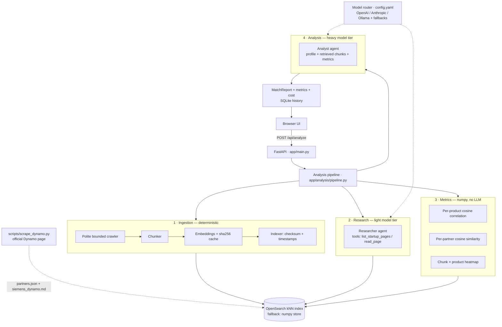

# partner-scout

**LLM-agent web application that evaluates a startup as a potential technology
partner for Siemens Digital Industries Software — from public sources only.**

Give it a startup URL. It crawls and indexes the site (with change detection),
an LLM agent builds a grounded product profile, numeric embedding metrics
measure where the offering correlates with the Siemens portfolio and with the
**real partners of the Siemens Dynamo program**, and a second agent produces
scored, justified analysis — rendered as radar/bar charts and a correlation
heatmap.

Built for the Siemens Dynamo home assignment. Machine-assisted development
(AI coding assistant) was used throughout, with every architectural decision
documented in [Design decisions](#design-decisions) — happy to walk through
any of them.

---

## Table of contents

- [Task requirements → implementation map](#task-requirements--implementation-map)
- [Quick start](#quick-start)
- [Architecture](#architecture)
- [Data & storage layers](#data--storage-layers) — *what is stored where, and what a vector DB even is*
- [Cost engineering](#cost-engineering)
- [Grounding: the official Dynamo data](#grounding-the-official-dynamo-data)
- [Match metrics & visualizations](#match-metrics--visualizations)
- [Evaluation](#evaluation) — *how we verified the system discriminates, with results*
- [Configuration](#configuration)
- [HTTP API](#http-api)
- [Project structure](#project-structure)
- [Design decisions](#design-decisions)
- [Deployment](#deployment)
- [Known limitations](#known-limitations)

---

## Task requirements → implementation map

| # | Requirement | Where |
|---|---|---|
| 1 | Input: startup URL | `POST /api/analyze`, single-field UI |
| 2 | Summarize the product offering from public sources | Research agent over crawled pages → `StartupProfile` (with `evidence_urls`) |
| 3 | Compare with Siemens DISW offerings (public sources) | RAG retrieval over the DISW portfolio + official Dynamo criteria → analyst agent `comparison` |
| 4 | Rank partnership potential 1-10 | `partnership_score` + five per-dimension scores |
| 5 | Justify the ranking | `partnership_justification` + per-dimension explanations |
| 6a | Compare to existing Siemens technology partners | Real Dynamo partners scraped from the official program page |
| 6b | Rank similarity to existing partners 1-10 | `partner_similarity_score`, grounded in cosine similarities |
| 6c | Justify that ranking | `partner_similarity_justification` + raw per-partner numbers in the UI |
| 6d | Deploy on cloud | [Deployment](#deployment) — Docker Compose / free PaaS path |
| 7 | Minimal UI | One page, one input, charts only where they carry information |

---

## Quick start

### Docker (recommended)

```bash
cp .env.example .env          # set OPENAI_API_KEY (minimum)
docker compose up --build     # OpenSearch + app
# open http://localhost:8000  → paste e.g. https://www.protex.ai/
```

### Local development

```bash
python -m venv .venv && source .venv/bin/activate
pip install -r requirements.txt
export OPENAI_API_KEY=sk-...
# either run OpenSearch (docker compose up opensearch),
# or set  search.backend: local  in config.yaml (zero infra)
uvicorn app.main:app --reload
```

### Refresh the reference data (optional)

```bash
python -m scripts.scrape_dynamo --fetch-sites   # re-scrape the Dynamo page
python -m scripts.seed                          # re-index (only changed docs)
```

### Fully local, zero-cost mode

```bash
docker compose --profile local up               # adds Ollama
ollama pull qwen2.5:7b && ollama pull nomic-embed-text
```

Then in `config.yaml`: point both routing tiers at `ollama:qwen2.5:7b` and set
embeddings to `provider: ollama, model: nomic-embed-text, dim: 768`
(dimension change requires re-creating the index — delete it and re-seed).

### Evaluation harness

A labelled set (`scripts/eval_set.json`) verifies the system *discriminates*
— not that it merely returns plausible prose:

```bash
python -m scripts.batch_eval            # app must be running
```

Categories and what they assert: **partner** (existing Dynamo partners — must
score high *and* surface themselves as a separated self-match peak, proving
the embedding+metric path is sound), **good** (real Industry-4.0 candidates —
high fit), **weak** (real tech outside Siemens' domain, e.g. healthcare AI —
mid/low fit), **bad** (consumer apps — low fit). The harness writes per-site
JSON logs plus `eval_results/summary.md` and flags any result that contradicts
its expected label. See [Evaluation](#evaluation) for the methodology and the
actual results.

---

## Architecture



The pipeline separates **deterministic ingestion** (what exists on the site)
from **model-driven analysis** (what it means). Everything the LLM asserts is
traceable: profile claims cite `evidence_urls`, scores reference numeric
similarities the UI also displays raw.

## Data & storage layers

This section explains every place data lives — from first principles, assuming
no prior familiarity with vector databases.

### First: what is a vector database, and why do we need one?

Computers can't compare *meaning* directly. A keyword search for "robot arm
programming" would miss a page that says "automating motion planning for
industrial manipulators" — same concept, no shared words.

An **embedding model** solves this. It turns a piece of text into a long list
of numbers (a **vector** — here 1,536 numbers) that represents the text's
*meaning*. Texts about similar things get similar vectors. "How similar?" is
measured by **cosine similarity**: a number from -1 to 1, where 1 means the
two texts point in the same semantic direction. In this project every cosine
number you see in the UI is exactly this.

A **vector database** stores these vectors and answers one question extremely
fast: *"given a query vector, which stored vectors are the most similar?"*
That's a **k-nearest-neighbours (kNN)** search. Doing it naively means
comparing the query against every stored vector; a vector DB uses an index
(here **HNSW** — a navigable graph that finds close neighbours without
checking everything) to do it in milliseconds even over millions of vectors.

We use it for two things: **retrieval** (pull the Siemens products most
relevant to *this* startup, so only they go into the analysis prompt — this is
RAG, retrieval-augmented generation) and **similarity metrics** (score how
close the startup is to each Siemens product and each existing partner).

We use **OpenSearch** as the vector DB — a real, production-grade, horizontally
scalable search engine with a native kNN index. A small **numpy fallback**
implements the exact same interface for zero-infrastructure runs (see
[design decision 7](#design-decisions)).

### The four storage layers

| # | Layer | Technology | Lives in | Holds | Keyed by |
|---|---|---|---|---|---|
| 1 | **Vector index** | OpenSearch (kNN, HNSW, cosine) | Docker volume `osdata` | Every text chunk — startup pages, Siemens portfolio, partners — each with its embedding vector + provenance + freshness metadata | `sha1(source_url)#chunk_no` |
| 2 | **Embedding cache** | SQLite `embed_cache.db` | app container → `/data` volume | Embedding vectors already computed, so identical text is never sent to the embedding API twice | `sha256(model + text)` |
| 3 | **Analysis cache & history** | SQLite `analyses.db` | app container → `/data` volume | Finished analysis results (for instant repeat + the `/api/analyses` history) | `url` |
| 4 | **Provider-side prompt cache** | OpenAI Responses API | OpenAI's servers (not ours) | Recently-seen prompt prefixes, billed at a reduced rate | (managed by OpenAI) |

*(Layer 1 has a drop-in alternative, `localstore.json` (numpy), used only when
`search.backend: local` — the same data, no OpenSearch required.)*

### What each vector-index record looks like

Every **chunk** (a ~1,200-character slice of a source document) is one record:

```
doc_type      startup | siemens | partner   (which corpus it belongs to)
group_id      startup domain / "siemens" / "partners"
source_url    provenance — the page URL or a reference:// pseudo-URL
chunk         the text itself
chunk_no      its position within the source document
checksum      sha256 of the FULL source document it came from
fetched_at    when that source's content last CHANGED
last_checked  when we last LOOKED at that source
embedding     the 1,536-number vector (this is what kNN searches)
```

### Freshness: `checksum` + two timestamps

The two timestamps answer different questions, and keeping them separate is
what makes incremental re-indexing possible:

- **`fetched_at`** — when the *content* last changed.
- **`last_checked`** — when we last *looked*, changed or not.

On every re-crawl the indexer hashes the freshly fetched document and compares
it to the stored `checksum`:

- **checksum identical** → content unchanged → just update `last_checked`.
  **No re-chunking, no re-embedding, zero API cost.**
- **checksum differs / source is new** → re-chunk, re-embed, and replace that
  source's chunks in the index.

So re-analysing an unchanged site is effectively free, and "is this record
stale, or merely unchanged since we last checked?" is answerable per document.

### Persistence: what survives which command

The distinction that bit us during development (and is worth knowing):

| Command | Vector index (`osdata`) | SQLite caches (`/data`) |
|---|---|---|
| `docker compose restart` | ✅ survives | ✅ survives |
| `docker compose up --build` | ✅ survives | ✅ survives¹ |
| `docker compose down` | ✅ survives | ✅ survives¹ |
| `docker compose down -v` | ❌ wiped | ❌ wiped |

¹ Because the SQLite caches are written to the `appdata` named volume via
`STATE_DIR=/data`. (Wipe everything for a clean slate with `down -v`; the app
re-seeds the reference data automatically on the next analysis.)

The application's own files — source code and `data/` — are **not** in Docker
at all; they live in the repository.

## Cost engineering

LLM spend is treated as a first-class engineering constraint, controlled at
four layers:

| Layer | Mechanism | Effect |
|---|---|---|
| **Model routing** | Pipeline stages request a *tier* (`light` / `heavy`), `config.yaml` maps tiers to models with cross-provider fallback chains (OpenAI → Anthropic → local Ollama) | Page reading runs on a cheap model; only final scoring pays for a frontier model. Provider outage degrades gracefully instead of failing |
| **Provider-side prompt caching** | OpenAI Responses API (automatic for prompts >1K tokens) | Repeated prefixes billed at cached rates |
| **Embedding cache** | Embedding vectors cached by `sha256(text)` (storage layer 2) | Identical text is never embedded twice — across restarts and across startups |
| **Checksum-gated re-indexing** | Unchanged sources (same checksum) are not re-chunked or re-embedded | Re-analysing an unchanged site skips the entire embedding cost |
| **Analysis cache** | Finished analyses cached by URL (storage layer 3) | A repeat request returns instantly at $0 |
| **Observability** | `/api/usage` — tokens + estimated USD per model; each analysis response carries its own `cost_usd` | You can't optimize what you don't measure |

A full analysis of a fresh site is a handful of LLM calls — on the measured
[evaluation run](#evaluation), **≈ $0.013–0.024 per startup** with the default
OpenAI tiers. The all-Ollama configuration runs the entire pipeline at zero
marginal cost (with reduced quality — the tradeoff is yours per tier).

> **Note on the crawler:** pages *are* re-fetched on each analysis (a handful
> of cheap HTTP GETs, which also keeps content fresh); what the caches above
> eliminate is the expensive part — embeddings and LLM calls — for unchanged
> content.

## Grounding: the official Dynamo data

`scripts/scrape_dynamo.py` scrapes the
[official Siemens Dynamo page](https://www.siemens.com/en-us/company/siemens-software-for-startups/siemens-dynamo/)
into the app's reference data:

- **`data/partners.json`** — the program's real partner startups
  (Instrumental, Cybord, Realtime Robotics, SkillReal, Inspekto, Percepto,
  Portcast, ...) with their page descriptions, **collaboration model**
  (Ecosystem / Portfolio / Research / Investment / Supplier) and **focus
  areas**; `--fetch-sites` enriches each with an excerpt of its own website.
- **`data/siemens_dynamo.md`** — what Siemens states it is looking for:
  program pitch, six focus areas, five collaboration models, eligibility and
  engagement process. Indexed as Siemens reference chunks, so partner-fit
  scores are grounded in the **program's own published criteria**, not only
  the product portfolio.

The live parse merges over an embedded snapshot of the same page, so a site
redesign can degrade freshness but can never leave the app with empty
reference data. Sites behind aggressive bot protection are skipped gracefully.

## Match metrics & visualizations

All similarity numbers are **computed with numpy from embeddings** — the LLM
interprets them, it does not invent them. The UI shows:

| Visualization | What it answers |
|---|---|
| **Radar** — 5 fit dimensions (technology overlap, market fit, integration potential, competitive risk, maturity signals), each 1-10 with an explanation | *What kind* of fit is this? |
| **Bar** — cosine correlation per Siemens product | *Which Siemens products* does the offering relate to, and how strongly? |
| **Bar** — cosine similarity per existing Dynamo partner | *Which proven partners* does this startup resemble? |
| **Heatmap** — startup content chunks × Siemens products | *Where exactly* in the startup's own material does the overlap live? |

Each analysis also reports runtime, LLM cost, and ingest stats
(new / updated / unchanged pages).

## Evaluation

An LLM that returns a plausible-sounding partnership analysis for *every* input
is useless — the whole value is in **discriminating** a real fit from a
non-fit. So the system ships with a small evaluation harness
(`scripts/batch_eval.py` + a labelled set in `scripts/eval_set.json`) that
runs a curated list of URLs through the live API and checks the results
against expectations.

### Methodology

Each URL is labelled with the outcome we expect:

| Label | Meaning | Expectation |
|---|---|---|
| **partner** | An **existing** Dynamo partner (Cybord, Realtime Robotics, Portcast, Retrocausal) | High fit **and** a *self-match peak*: because the partner is already in the reference list, analysing it must surface itself as the clearly-separated top partner-similarity hit — this is a direct sanity check on the whole embedding + cosine path |
| **good** | Strong non-listed Industry-4.0 candidate (Protex AI, Augury) | High fit |
| **weak** | Real technology, but outside Siemens' domain (Viz.ai — healthcare AI; Notion — B2B productivity) | Middling-to-low fit — tests the *domain boundary* |
| **bad** | Clearly out of domain (Airbnb) | Low fit — the core discrimination test |

The harness flags any result that contradicts its label, plus structural
checks (evidence URLs present, exactly five fit dimensions, runtime sane). It
exits non-zero if any flag fires, so it can gate CI.

### On the self-match check (a note on doing this honestly)

The first calibration of the self-match test used an **absolute** threshold
(self-similarity ≥ 0.85). It fired false alarms: every existing partner
correctly ranked *itself* #1, but at ~0.79–0.83, not ≥ 0.85. The reason is
sound — the "self" comparison is between the LLM-written *summary of the
crawled site* and the *Dynamo-page description* of the same company: two
different texts about one company embed to ~0.8, not ~1.0 (unrelated companies
sit at ~0.3–0.5). The fix was to test the right property — a **dominant,
separated peak** (top hit ≥ 0.70 **and** ≥ 0.08 above the next partner) rather
than an absolute value. This same first run also surfaced a **real bug**:
partners with long descriptions were split into several chunks and appeared
multiple times in the similarity ranking; the metric now aggregates by partner
name (max over chunks). Both are in the git history.

### Results

Latest run (`eval_results/summary.md`, 9 sites, ✅ **no anomalies**, total LLM
cost ≈ $0.17):

| Category | Company | Fit /10 | Partner-sim /10 | Self-match peak | Cost |
|---|---|---|---|---|---|
| partner | Realtime Robotics | 9 | 9 | 0.79 | $0.019 |
| partner | Retrocausal | 9 | 9 | 0.82 | $0.023 |
| partner | Cybord | 8 | 8 | 0.80 | $0.024 |
| partner | Portcast | 7 | 7 | 0.82 | $0.019 |
| good | Protex AI | 8 | 7 | — | $0.019 |
| good | Augury | 7 | 7 | — | $0.018 |
| weak | Notion | 5 | 4 | — | $0.015 |
| weak | Viz.ai | 3 | 4 | — | $0.017 |
| bad | Airbnb | 2 | 2 | — | $0.013 |

The scores form a clean monotonic gradient — **existing partners and strong
candidates 7–9, out-of-domain tech in the low single digits, Airbnb at the
floor.** The system rewards genuine Industry-4.0 fit and is not fooled into
producing a high score for a consumer travel site. Note the nuance between the
two "weak" cases: Notion (a B2B tool with a thin low-code thread) lands at 5
with a measured justification, correctly *above* Viz.ai's healthcare-AI 3 and
well above Airbnb's 2.

Reproduce with `python -m scripts.batch_eval` (app running); per-site JSON and
the summary land in `eval_results/`.

## Configuration

Single file: [`config.yaml`](config.yaml).

```yaml
routing:
  light:                      # extraction, page reading
    primary: "openai:gpt-5-mini"
    fallbacks: ["anthropic:claude-haiku-4-5", "ollama:qwen2.5:7b"]
  heavy:                      # comparison, scoring, justification
    primary: "openai:gpt-5.1"
    fallbacks: ["anthropic:claude-sonnet-5", "openai:gpt-5-mini"]

embeddings: {provider: openai, model: text-embedding-3-small, dim: 1536}
prices:     {...}             # $/1M tokens for the /api/usage report
crawler:    {max_pages: 6, page_char_limit: 12000, delay_seconds: 0.5}
search:     {backend: opensearch, index: partner-scout-docs}
```

Model spec format is `provider:model`. Environment variables:
`OPENAI_API_KEY`, `ANTHROPIC_API_KEY` (if routed), `OLLAMA_BASE_URL`,
`OPENSEARCH_URL`, `AGENTS_TRACING`. See [`.env.example`](.env.example).

## HTTP API

| Endpoint | Description |
|---|---|
| `POST /api/analyze` `{url, force}` | Full pipeline. `force: true` re-crawls and re-analyzes, bypassing caches |
| `GET /api/analyses` | History of analyzed startups (company, score, timestamp) |
| `GET /api/usage` | Tokens + estimated USD per model since process start |
| `GET /api/health` | Liveness |

Response shape of `/api/analyze` (abridged):

```jsonc
{
  "profile":  { "company_name": "...", "summary": "...", "technologies": [...], "evidence_urls": [...] },
  "report":   { "comparison": "...", "partnership_score": 8, "partnership_justification": "...",
                "partner_similarity_score": 7, "partner_similarity_justification": "...",
                "dimensions": [ { "name": "technology_overlap", "score": 8, "explanation": "..." }, ... ] },
  "metrics":  { "product_correlation": [...], "partner_similarity": [...], "heatmap": {...} },
  "ingest":   { "new": 4, "updated": 1, "unchanged": 1 },
  "runtime_s": 74.2, "cost_usd": 0.031, "cached": false
}
```

## Project structure

```
app/
  main.py                FastAPI entry point + routes
  models.py              Pydantic contracts between all stages
  config.py              env + config.yaml loading
  llm/router.py          tier routing, fallback chains, usage/cost tracking
  ingest/
    crawler.py           polite bounded same-domain crawler
    chunker.py           paragraph-aware chunking (~1200 chars, overlap)
    embeddings.py        pluggable provider + sha256-keyed cache
    indexer.py           checksum/timestamp freshness logic
    seed.py              reference-data ingestion (all data/*.md + partners)
  search/
    store.py             VectorStore protocol
    opensearch_store.py  kNN (HNSW, cosine) primary backend
    local_store.py       numpy fallback — zero-infra demos & free PaaS
  analysis/
    llm_agents.py        researcher & analyst agents (OpenAI Agents SDK)
    metrics.py           numpy cosine metrics: products, partners, heatmap
    pipeline.py          orchestration + SQLite history
  web/index.html         minimal UI + Chart.js visualizations
scripts/
  scrape_dynamo.py       official Dynamo page → partners.json + siemens_dynamo.md
  seed.py                explicit re-seeding entry point
data/                    reference data (versioned, regenerable)
```

## Design decisions

1. **Ingestion is deterministic; only analysis is model-driven.** The crawler
   decides *what exists*, the agents decide *what it means*. Runs are
   reproducible and debuggable, and the index is a persistent asset — every
   re-run gets cheaper.
2. **Tier routing, not one model.** Reading web pages doesn't need a frontier
   model; scoring a partnership does. Splitting the pipeline by required
   capability is the single biggest LLM cost lever, and the fallback chains
   double as availability engineering.
3. **Checksums + dual timestamps on every document.** "Has the source changed
   since we looked?" is O(1), and unchanged content costs zero tokens.
4. **Numbers before narrative.** Cosine similarities are computed outside the
   LLM and handed to it as evidence. The 1-10 ranks are model judgment
   *grounded in metrics*, and the UI exposes the raw numbers so a human can
   audit the reasoning.
5. **Grounded in the program's own criteria.** The partner list and the
   "what Siemens looks for" corpus are scraped from the official Dynamo page
   — the comparison target is real, current, and refreshable with one command.
6. **Structured outputs end-to-end.** Both agents return validated Pydantic
   models (`output_type=`) — there is no JSON-parsing failure mode.
7. **Pluggable vector store.** OpenSearch is the real backend (kNN, scalable,
   hybrid-search capable); the numpy fallback keeps the app runnable with
   zero infrastructure. Same `VectorStore` protocol, one config line to swap.
8. **Agents read the index, not the live web.** Tool calls
   (`list_startup_pages` / `read_page`) hit our own store — analysis is
   reproducible against a frozen snapshot, and no LLM decision can trigger
   unbounded crawling.

## Deployment

### Access control

The deployed instance is wired to real (paid) LLM API keys and this repo is
public, so the app supports **optional HTTP Basic Auth**: set `APP_USER` and
`APP_PASSWORD` and the whole app is locked behind a browser login; leave them
unset (local dev) and it stays open. `GET /api/health` is always open for the
platform's health check. **Always set these in any public deployment** — see
[app/auth.py](app/auth.py).

### Railway (paid, single service — recommended for a demo)

Deploys straight from the `Dockerfile`. The container honours Railway's
injected `$PORT`.

1. New Project → Deploy from GitHub repo.
2. Variables: `OPENAI_API_KEY`, `APP_USER`, `APP_PASSWORD`, `SEARCH_BACKEND=local`,
   and `STATE_DIR=/data`.
3. Attach a volume mounted at `/data` so the SQLite caches persist across
   redeploys (optional for a short-lived demo — it re-seeds on first request).

`SEARCH_BACKEND=local` uses the built-in numpy vector store — at this scale
(~hundreds of vectors) it is functionally identical to OpenSearch and needs no
second service.

### Railway with OpenSearch (faithful to the production architecture)

If you want the live demo to run the real vector DB (e.g. to mirror what you
describe as the architecture), add OpenSearch as a second Railway service:

1. Add Service → Docker Image → `opensearchproject/opensearch:2.17.0`.
2. Its variables: `discovery.type=single-node`,
   `plugins.security.disabled=true`, `OPENSEARCH_JAVA_OPTS=-Xms512m -Xmx512m`,
   `OPENSEARCH_INITIAL_ADMIN_PASSWORD=<something-strong>`; attach a volume at
   `/usr/share/opensearch/data`. Give the service ~1 GB RAM (OpenSearch is a
   JVM service and will OOM below that).
3. On the app service, drop `SEARCH_BACKEND` (or set it to `opensearch`) and
   set `OPENSEARCH_URL=http://<opensearch-service>.railway.internal:9200`
   (Railway private networking).

Tradeoff: more faithful and more impressive if inspected, but costs more RAM
and adds a service. For a few-days demo the single-service `local` path is the
pragmatic choice; the OpenSearch integration is fully present in the codebase
either way.

### Other targets

| Path | How |
|---|---|
| **VM (full stack)** | Any small VM (e.g. Oracle Cloud free tier): clone → `.env` → `docker compose up -d` (runs app + OpenSearch together) |
| **Managed OpenSearch** | Point `OPENSEARCH_URL` at any hosted cluster (Aiven, AWS OpenSearch), deploy the app anywhere |

Caches (SQLite/localstore) are performance optimizations, not data — safe to
lose. With a mounted volume + `STATE_DIR` they persist; without one they
rebuild on the next request.

## Known limitations

Deliberate scope cuts, in the spirit of an honest POC:

- **JS-only sites yield thin text** — no headless browser. The agent reports
  what it found rather than guessing; adding Playwright to the crawler is a
  contained change.
- **The DISW portfolio corpus is a curated snapshot** (`data/siemens_portfolio.md`).
  A production version would ingest siemens.com product pages through the
  same checksum-aware pipeline — the mechanism already supports it.
- **Local models must support tool calling** (qwen2.5 and llama3.1 do).
- **Scores are decision support, not decisions** — the justifications and raw
  metrics exist precisely so a human can disagree with the model.
- **Auth is a single shared HTTP Basic credential** — enough to keep a public
  demo's API keys from being abused; a production system would use real
  per-user auth (OAuth/SSO). See [Deployment → Access control](#access-control).
